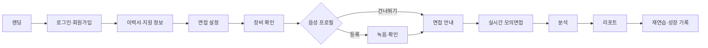

# FaceFit 서비스 기획서

| 항목 | 내용 |
| --- | --- |
| 목적 | FaceFit이 해결할 문제와 V1.0의 제품 범위를 한 문서에서 합의한다. |
| 대상 독자 | PM, UX, 개발, QA, 이해관계자 |
| 버전 | 1.0 |
| 작성일 | 2026-07-20 |
| 상태 | 검토 필요 |

## 서비스 한 줄 정의

FaceFit은 취업 준비자가 자신의 경험을 실제 면접과 유사한 음성 대화로 설명하고, 답변 내용·발화·시선·자세의 근거를 확인하며 반복 개선하는 데스크톱 웹 모의면접 코칭 서비스다.

## 문제와 사용자 맥락

취업 준비자는 예상 질문과 모범 답안을 외워도 실제 면접에서는 질문 의도를 파악하고 자신의 경험을 구조적으로 설명하는 데 어려움을 겪는다. 일반 녹화는 스스로 무엇을 고쳐야 하는지 판단하기 어렵고, 점수만 제시하는 서비스는 낮은 점수의 근거와 다음 행동을 설명하지 못한다. FaceFit은 이력서·지원 정보에 맞는 질문, 실제 면접관과 대화하는 흐름, 근거가 연결된 4축 피드백을 하나의 연습 루프로 제공한다.

## 핵심 사용자와 니즈

| 사용자 | 상황 | 핵심 니즈 |
| --- | --- | --- |
| 첫 취업 준비자 | 면접 경험이 적고 답변 구조가 불안정하다. | 실제 흐름에 익숙해지고 구체적 개선점을 알고 싶다. |
| 직무 전환자 | 기존 경험을 목표 직무 언어로 설명해야 한다. | 이력서 기반 질문과 경험 연결 피드백이 필요하다. |
| 반복 연습자 | 여러 번 연습했지만 개선 여부를 판단하기 어렵다. | 동일 축의 변화와 다음 연습 목표를 확인하고 싶다. |

## 가치 제안과 차별점

| 문제 | FaceFit 대응 | 사용자 가치 |
| --- | --- | --- |
| 외운 답변은 변형 질문에 약하다. | 이력서·직무 맥락과 이전 답변을 활용한 질문 흐름 | 자신의 경험을 설명하는 연습 |
| 혼자 녹화하면 평가 기준이 모호하다. | 답변 문장, 발화 구간, 시선·자세 구간을 근거로 연결 | 무엇을 왜 고쳐야 하는지 이해 |
| 분석 한 번으로 끝난다. | 리포트, 재연습, 성장 기록 연결 | 개선 여부를 반복 확인 |
| 정적 챗봇은 면접 몰입감이 낮다. | OpenAvatarChat과 MuseTalk 기반 실시간 면접관 목표 | 시청각 대화 흐름 경험 |

## 핵심 기능

- 계정 진입과 이력서·지원 기업·목표 직무 입력
- 기술·HR·경영진 면접관 및 일반·압박 강도 선택
- 카메라·마이크·스피커 확인과 카메라 미리보기
- 선택형 음성 프로필 녹음·재생·건너뛰기
- 5개 질문 기반 면접, 답변 완료 버튼, Space 단축키, 종료 확인
- 실시간 면접관 음성·영상, 장애 시 단계적 폴백
- 답변 내용·발화·시선·자세의 근거 기반 분석
- 분석 진행 상태, 결과 리포트, 재연습, 성장 기록

## 전체 사용자 흐름

## V1.0 범위

| 포함 | 설명 |
| --- | --- |
| 데스크톱 웹 | 반응형 웹은 유지하지만 모바일 앱은 기획하지 않는다. |
| 5문항 면접 | 예상 15~20분, 수동 답변 완료를 기본으로 한다. |
| 3개 면접관·2개 강도 | 질문 관점과 표현을 다르게 한다. |
| 반이중 실시간 대화 | 면접관 발화와 사용자 답변 구간을 명확히 분리한다. |
| 설명 가능한 4축 리포트 | 점수, 근거, 개선 행동을 연결한다. |
| 성장 기록 | 완료한 세션을 동일 축으로 비교한다. |

## 범위 제외

- 실제 결제, 이용권, 구독, PG 연동
- 관리자 페이지와 채용 의사결정 기능
- 모바일 네이티브 앱
- 감정·성격·심리 상태 진단
- 채용 합격 가능성 단정
- 사용자 동의 없는 음성 복제
- API 엔드포인트와 DB 스키마의 프론트 선확정

## 성공 기준

- 사용자가 가입부터 리포트 조회까지 핵심 흐름을 중단 없이 완료한다.
- 리포트의 모든 개선 항목이 답변 또는 관찰 근거와 연결된다.
- 면접관 장애가 발생해도 음성 또는 정적 화면으로 세션을 계속할 수 있다.
- 요구사항, 기능, 화면, 데이터, 연동, QA가 추적표에서 연결된다.
- 정량 목표값은 [협의 필요]이며 측정 설계는 14 문서를 따른다.

## 제약과 리스크

- 프론트엔드는 React+Vite+TypeScript로 전환 완료했다. 기존 화면·행동·URL을 React Router SPA로 보존했으며, 실제 인증·AI·백엔드 구현은 후속 범위다.
- 브라우저 장치 권한과 사용자 환경이 품질에 직접 영향을 준다.
- MuseTalk은 GPU 의존성이 있어 동시 접속 비용과 용량 검증이 필요하다.
- STT·VAD 오류가 답변 경계와 질문 흐름을 왜곡할 수 있다.
- 시선·자세 분석은 환경 차이와 공정성 검토가 필요하다.
- 현재 UI는 목업 데이터와 실제 연동 상태가 혼재한다.

## 향후 고도화

- 자연스러운 끼어들기와 전이중 대화
- 답변 맥락 기반 꼬리 질문
- 사용자 동의 기반 개선 답변 음성 재생
- 역질문 추천과 특정 역량 집중 연습
- 접근성 검증 후 반응형 범위 확대

## 미결정 사항

- React+Vite 전환·배포 방식과 AI·백엔드 운영 환경
- 이력서·영상·음성의 보존 기간과 삭제 SLA
- 평가 점수 산식과 비교 집단의 정의

## 다음 협의 항목

- 06 요구사항의 P0 범위를 제품·개발·QA가 공동 승인한다.
- 10 정책의 협의 필요 항목에 결정권자와 기한을 배정한다.
