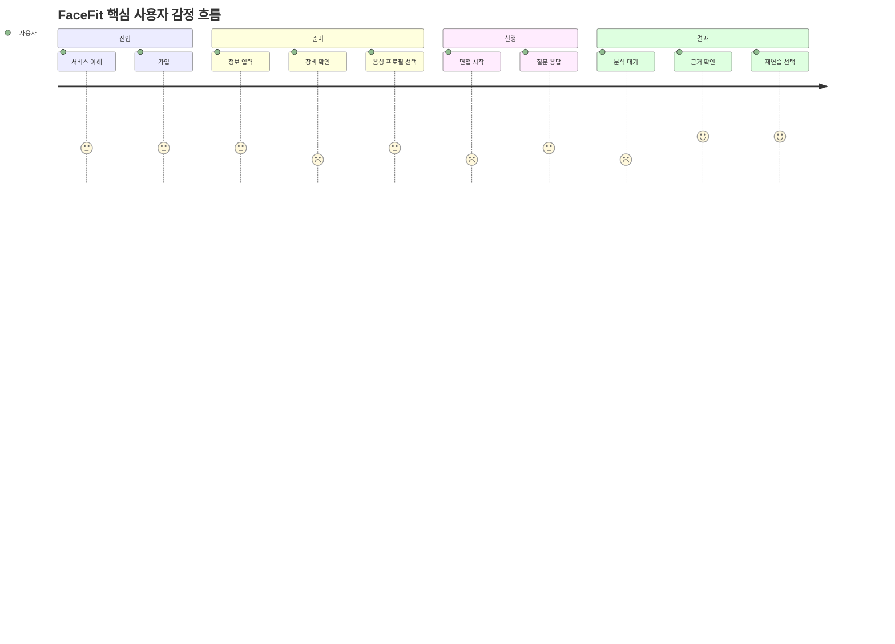

# FaceFit 사용자 여정 지도

| 항목 | 내용 |
| --- | --- |
| 목적 | 첫 인지부터 재연습까지 사용자 경험과 개선 기회를 단계별로 연결한다. |
| 대상 독자 | PM, UX, 콘텐츠, 데이터 분석 |
| 버전 | 1.0 |
| 작성일 | 2026-07-20 |
| 상태 | 가설·검증 필요 |

## 여정 지도

| 단계 | 행동 | 생각·감정 | 불편 | 접점 | 서비스 대응 | 개선 기회 | 측정 지표 |
| --- | --- | --- | --- | --- | --- | --- | --- |
| 인지 | 랜딩에서 기능과 사례를 살핀다. | “점수만 주는 서비스와 다른가?” 기대·경계 | 분석 신뢰성 판단이 어려움 | SC-001 | 4축 근거, 실제 흐름, 샘플 리포트 설명 | 분석 근거와 비진단 원칙을 먼저 제시 | 랜딩→가입 전환, 핵심 섹션 도달 |
| 가입 | 로그인 또는 회원가입을 시도한다. | “빨리 연습하고 싶다.” 조급함 | 가입 절차와 개인정보 부담 | SC-002, SC-003 | 최소 입력과 명확한 오류 안내 | 체험 진입 방식 [협의 필요] | 가입 시작·완료·실패 |
| 면접 준비 | 이력서·기업·직무·면접관·강도를 설정한다. | “내 상황에 맞는 질문이 나올까?” 기대 | 문서 업로드 실패, 선택 기준 모호 | SC-004 | 텍스트·파일 입력, 선택 요약 | 입력 이유와 사용 범위 표시 | 설정 시작·완료, 업로드 실패 |
| 장비 확인 | 권한을 허용하고 미리보기·음성을 확인한다. | “카메라가 제대로 보일까?” 긴장 | 권한 거부, 장치 없음, 소음 | SC-005 | 장치별 상태, 복구 안내, 환경 체크 | 실제 권한 상태와 목업 분리 | 권한 허용률, 장비 확인 완료율 |
| 음성 프로필 | 안내 문장을 녹음하거나 건너뛴다. | 유용함과 개인정보 우려가 함께 존재 | 선택 기능인지 불명확할 수 있음 | SC-006 | 선택 사항, 저장 미수행 데모 표시 | 동의·보존·삭제 정책 확정 | 시작·완료·건너뛰기 |
| 면접 진행 | 질문을 듣고 답하며 완료를 선택한다. | 긴장→몰입 | 지연, 침묵 감지 오작동, 단축키 실수 | SC-007, SC-008 | 온보딩, 수동 완료, 상태 표시, 폴백 | 네트워크·아바타 상태를 이해 가능한 언어로 표시 | 시작·완료, 중도 종료, 턴 지연 |
| 결과 확인 | 분석 진행을 보고 리포트를 읽는다. | “왜 이런 결과지?” 궁금함 | 분석 지연, 근거 없는 점수 | SC-009, SC-010 | 단계 상태, 근거·개선 행동 연결 | 근거에서 재연습 CTA까지 연결 | 리포트 조회, 근거 열람, 분석 실패 |
| 재연습 | 대시보드에서 기록과 취약 축을 확인한다. | “정말 좋아졌나?” 동기·의심 | 비교 기준·표본 부족 | SC-011 | 동일 축 추이, 추천 연습 | 2회 미만 빈 상태와 목표 설정 | 7일 재연습률, 완료 세션 수 |

## 감정 곡선

## 미결정 사항

- 단계별 목표 전환율과 허용 이탈률
- 리포트 근거 열람을 성공 행동으로 볼지 여부

## 다음 협의 항목

- 14의 이벤트 속성으로 여정 지표를 구현 가능하게 검토한다.
- 사용성 테스트에서 장비 확인과 분석 대기의 감정 저점을 우선 관찰한다.
