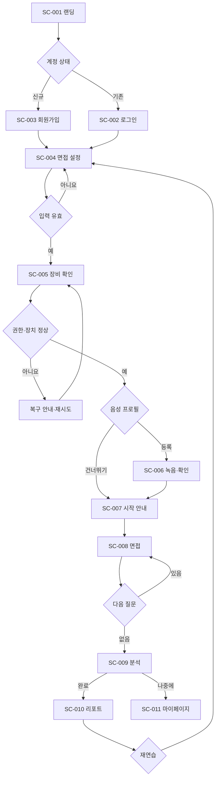
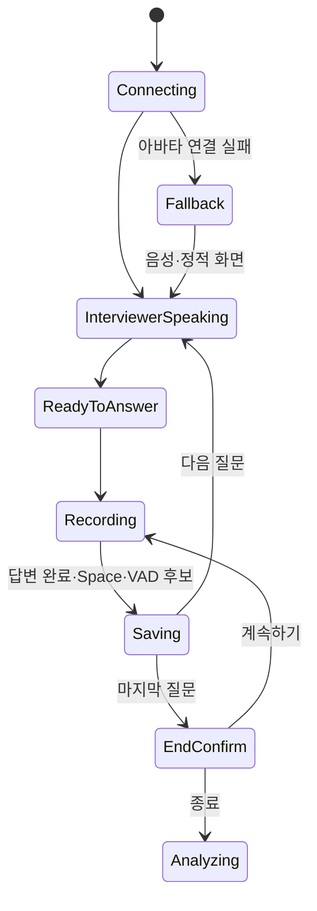

# FaceFit 사용자 플로우

| 항목 | 내용 |
| --- | --- |
| 목적 | 핵심 행동의 정상·분기·오류·종료 흐름을 화면과 요구사항에 연결한다. |
| 대상 독자 | UX, 프론트엔드, AI·백엔드, QA |
| 버전 | 1.0 |
| 작성일 | 2026-07-20 |
| 상태 | 검토 필요 |

## 전체 플로우

## 필수 플로우 정의

| 플로우 ID | 시작 조건 | 정상 흐름 | 분기·오류 흐름 | 종료 조건 | 화면 | 요구사항 |
| --- | --- | --- | --- | --- | --- | --- |
| FL-01 신규 첫 이용 | 비로그인·첫 방문 | 랜딩→가입→설정 | 가입 실패 시 오류 후 재시도 | SC-004 진입 | SC-001~004 | BR-001, UR-001, FR-001 |
| FL-02 로그인 재이용 | 기존 계정 | 로그인→대시보드 또는 새 면접 | 인증 실패·세션 만료 | SC-004/011 진입 | SC-002, SC-011 | FR-001, SEC-002 |
| FL-03 이력서 업로드 | SC-004·파일 보유 | 선택→검증→업로드 성공 | 형식·용량·네트워크 실패→재시도/텍스트 입력 | 파일 상태 저장 [협의] | SC-004 | FR-002, FR-003 |
| FL-04 면접 설정 | 지원 정보 입력 가능 | 기업·직무→면접관→강도→요약 | 필수값 누락 시 해당 필드 안내 | SC-005 이동 | SC-004 | FR-003~006 |
| FL-05 장비 권한 허용 | SC-005 진입 | 권한 요청→허용→장치·미리보기 확인 | 일부 장치 실패 시 재선택 | 시작 조건 충족 | SC-005 | FR-007~009 |
| FL-06 장비 권한 거부 | 권한 요청 표시 | 거부→설정 방법→재요청 | 계속 거부 시 면접 시작 차단 [협의] | 허용 또는 이탈 | SC-005 | FR-007, SEC-004 |
| FL-07 음성 녹음 | 사용자가 등록 선택 | 안내→녹음→재생→사용 | 마이크 오류·녹음 실패→재녹음 | 생성 요청 또는 준비 완료 [협의] | SC-006 | FR-010 |
| FL-08 음성 건너뛰기 | SC-006 안내 상태 | 건너뛰기→면접 안내 | 저장 연동 실패와 무관하게 세션 진행 | SC-007 | SC-006, SC-007 | FR-011 |
| FL-09 면접 시작 | 장비 확인 완료 | 온보딩 확인→세션 연결→첫 질문 | 연결 실패→재시도/폴백 | 첫 질문 표시 | SC-007, SC-008 | FR-012~014 |
| FL-10 답변 완료 | 녹음 중 | 버튼 또는 Space→중복 잠금→답변 저장→다음 질문 | 입력 요소 포커스·모달·처리 중 Space 무시 | 다음 질문 또는 종료 확인 | SC-008 | FR-015~017 |
| FL-11 침묵 감지 | 사용자 답변 중·VAD 연결 | 침묵 후보→보조 완료 신호 | 오탐 시 수동 완료 유지·자동 확정 정책 [협의] | 다음 턴 후보 | SC-008 | FR-018 |
| FL-12 면접 종료 | 마지막 답변 또는 종료 버튼 | 종료 확인→세션 마감→분석 생성 | 취소 시 면접 복귀, 저장 실패 시 재시도 | SC-009 | SC-008, SC-009 | FR-019, FR-020 |
| FL-13 분석 대기 | 세션 마감 성공 | 5단계 상태 조회→완료 | 지연·실패→안내·재조회, 나중에 확인→대시보드 | SC-010/011 | SC-009 | FR-021, FR-022 |
| FL-14 리포트 확인 | 분석 완료 | 종합→4축→근거→개선 행동 | 일부 축 없음·결과 없음 상태 | 재연습 또는 대시보드 | SC-010 | FR-023~025 |
| FL-15 재연습 | 리포트·대시보드 | 재연습 선택→설정 확인→새 세션 | 이전 설정 불러오기 실패 시 새 설정 | SC-004/008 | SC-010, SC-011 | FR-026 |
| FL-16 마이페이지 조회 | 로그인·기록 존재/없음 | 최근 기록·성장 추이 확인 | 빈 상태·분석 중·실패 상태 | 리포트 또는 재연습 | SC-011 | FR-027, FR-028 |

## 답변 턴 상태

## 미결정 사항

- VAD가 자동 완료를 확정하는지 사용자 확인을 요구하는지 여부
- 재연습 시 이전 설정과 질문을 어느 범위까지 복제할지
- 인증 없이 체험 면접을 허용할지

## 다음 협의 항목

- AI·백엔드는 FL-09~13의 상태 이벤트를 정의한다.
- QA는 각 오류 흐름을 15의 테스트와 연결한다.
