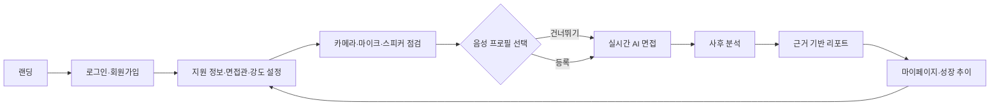

# Face Fit PRD

> 버전: 0.2  
> 기준일: 2026-07-20  
> 상태: MVP 구현 기준  
> 제품 한 줄 정의: 실제 면접처럼 대화하고, 평가 근거와 다음 연습 행동을 이해할 수 있는 설명형 AI 면접 코칭 서비스

## 1. 배경과 문제

취업 준비생은 AI 면접이나 영상 면접을 반복해서 연습하더라도 무엇이 좋았고 무엇을 고쳐야 하는지 파악하기 어렵다. 기존 연습 경험은 총점이나 일반적인 조언에 머무르는 경우가 많고, 시선·발화·자세·답변 내용 가운데 어떤 관측 근거가 평가에 영향을 주었는지 설명하지 못한다.

Face Fit은 다음 문제를 해결한다.

1. 정적인 질문 목록만으로는 실제 면접의 긴장감과 맥락형 꼬리질문을 연습하기 어렵다.
2. 결과 점수만으로는 사용자가 다음 면접에서 무엇을 바꿔야 하는지 알기 어렵다.
3. 전문 코칭은 반복 이용 비용과 접근성에 제약이 있다.
4. 연습 기록이 단절되어 회차별 성장과 반복되는 약점을 확인하기 어렵다.

## 2. 제품 목표와 비목표

### 2.1 목표

- 기술·HR·경영진 면접관 중 하나를 선택해 15~20분 동안 몰입형 모의면접을 진행한다.
- OpenAvatarChat의 실시간 대화 파이프라인과 MuseTalk 면접관 영상을 결합해 질문·답변·꼬리질문 흐름을 자연스럽게 제공한다.
- 시선 접촉, 발화 안정, 자세, 답변 내용의 4축 결과를 관측 근거와 함께 설명한다.
- 질문별 개선 행동, 개선 답변, 재연습 경로를 제공한다.
- 회차별 변화와 우선 개선 항목을 누적해 데이터 기반 성장 경험을 만든다.

### 2.2 비목표

- 실제 채용의 합격·불합격 판정 또는 지원자 선발 자동화
- 성격, 정신건강, 진실성 등 관측 불가능하거나 과학적 타당성이 부족한 특성의 추론
- 표정에서 감정을 단정해 종합 점수에 반영하는 기능
- MVP 단계의 완전한 자유 대화, 다중 면접관 패널, 전 직무 지원
- 명시적 동의 없는 음성 복제 또는 장기 원본 영상 보관

## 3. 주요 사용자

### 3.1 1차 사용자

AI·개발 직무 취업 준비생. 이력서와 채용 공고에 맞춘 질문, 기술 경험을 구조화하는 연습, 카메라 앞 전달력 교정을 필요로 한다.

### 3.2 확장 사용자

- 대학 취업지원센터의 학생·운영자
- 마케팅·영업·디자인 등 비개발 직무 지원자
- 발표 및 스피치 훈련 사용자

기관 관리자 기능과 직무군 확장은 MVP 이후 범위다.

## 4. 핵심 사용자 여정

## 5. MVP 범위

### 5.1 계정과 접근

| ID | 요구사항 | 우선순위 | 수용 기준 |
| --- | --- | --- | --- |
| AUTH-01 | 소셜 로그인과 기본 회원가입을 제공한다. | P0 | 인증 성공 후 새 면접 또는 마이페이지로 이동한다. |
| AUTH-02 | 카메라·마이크·영상 분석·저장 정책 동의를 구분해 받는다. | P0 | 필수·선택 동의가 분리되고 동의 이력이 저장된다. |
| AUTH-03 | 사용자는 원본 미디어와 계정 삭제를 요청할 수 있다. | P0 | 요청 상태와 완료 시점을 확인할 수 있다. |

### 5.2 면접 설정

| ID | 요구사항 | 우선순위 | 수용 기준 |
| --- | --- | --- | --- |
| SET-01 | 기업명, 지원 직무, 이력서, 채용 공고를 입력한다. | P0 | 필수값 검증 후 세션 설정에 저장된다. |
| SET-02 | 기술·HR·경영진 면접관 중 하나를 선택한다. | P0 | 선택값이 질문 전략과 면접관 프롬프트에 반영된다. |
| SET-03 | 일반·압박 강도를 선택한다. | P0 | 압박형도 공격·모욕 표현 없이 검증 질문의 빈도와 깊이만 높인다. |
| SET-04 | 기본 면접은 5문항, 예상 15~20분으로 구성한다. | P0 | 진행 화면에 현재 문항과 전체 문항 수가 표시된다. |
| SET-05 | 이력서·공고가 없을 때 직무 공통 질문으로 폴백한다. | P0 | 업로드 실패가 세션 시작을 막지 않고 대체 범위를 알린다. |

### 5.3 장비 확인과 음성 프로필

| ID | 요구사항 | 우선순위 | 수용 기준 |
| --- | --- | --- | --- |
| DEV-01 | 카메라·마이크·스피커 선택과 권한 상태를 확인한다. | P0 | 장치별 성공·실패·재시도 상태가 구분된다. |
| DEV-02 | 얼굴 중앙, 눈높이, 어깨선, 조도, 주변 소음 가이드를 제공한다. | P0 | 시작 전 최소 얼굴 감지와 마이크 입력 여부를 검증한다. |
| DEV-03 | 음성 프로필은 선택 기능이며 등록하지 않아도 면접을 진행한다. | P0 | 건너뛰기 경로가 항상 제공된다. |
| DEV-04 | 사용자 음성 기반 개선 답변 재생은 별도 동의형 베타로 제공한다. | P2 | 생성·보존·삭제 범위가 명시되고 철회 시 파생 데이터도 삭제된다. |

### 5.4 실시간 AI 면접

| ID | 요구사항 | 우선순위 | 수용 기준 |
| --- | --- | --- | --- |
| LIVE-01 | MuseTalk 영상 면접관이 TTS 음성과 립싱크해 질문한다. | P0 | 오디오·영상이 재생되고 장시간 정지 없이 5문항을 완료한다. |
| LIVE-02 | OpenAvatarChat이 VAD→ASR→LLM→TTS→Avatar 흐름을 조정한다. | P0 | 한 세션 안에서 컴포넌트 오류 상태와 지연이 추적된다. |
| LIVE-03 | 면접관 유형·강도·기업·직무 맥락을 모든 턴에서 유지한다. | P0 | 금지 지시와 질문 정책을 포함한 세션 프롬프트 테스트를 통과한다. |
| LIVE-04 | 기본 질문마다 답변 내용 기반 꼬리질문을 0~1개 생성한다. | P1 | 중복·주제 이탈·개인정보 과다 질문을 차단한다. |
| LIVE-05 | 5초 침묵 또는 답변 완료 버튼·Space 키로 턴을 종료한다. | P0 | 자동 종료 전 시각적 안내가 있고 수동 종료가 항상 작동한다. |
| LIVE-06 | 사용자가 면접관 발화를 수동으로 중단할 수 있다. | P1 | 중단 후 1초 이내 재생이 멈추고 새 발화가 처리된다. |
| LIVE-07 | 전이중 인터럽트는 반이중 안정화 후 실험 기능으로 연다. | P1 | 에코·오검출률 기준을 충족하지 못하면 반이중으로 자동 폴백한다. |
| LIVE-08 | 연결이 끊기면 세션 복구 또는 안전 종료를 제공한다. | P0 | 마지막 완료 턴까지 복구되고 중복 질문이 생성되지 않는다. |

### 5.5 분석과 리포트

| ID | 요구사항 | 우선순위 | 수용 기준 |
| --- | --- | --- | --- |
| ANL-01 | 시선 접촉률과 고개·어깨 안정성을 영상에서 계산한다. | P0 | 얼굴 미검출·프레임 부족 구간은 점수 대신 신뢰도 부족으로 표시한다. |
| ANL-02 | 발화 속도, 필러, 침묵, 응답 지연을 타임스탬프와 함께 계산한다. | P0 | 원문·오디오 위치와 지표 근거가 연결된다. |
| ANL-03 | 답변의 질문 의도 충족, 구조, 구체성, 근거를 평가한다. | P0 | 루브릭 항목별 근거 문장과 개선 제안이 제공된다. |
| ANL-04 | 4축 점수와 종합 요약을 생성한다. | P0 | 점수마다 측정 근거, 신뢰도, 개선 행동이 표시된다. |
| ANL-05 | 질문별 피드백과 개선 답변을 제공한다. | P1 | 원문을 왜곡하지 않고 사용자 경험을 바탕으로 개선 예시를 만든다. |
| ANL-06 | 면접 말미에 기업·직무 맥락의 역질문과 피해야 할 질문 유형을 제안한다. | P1 | 출처가 필요한 기업 사실은 검증되지 않은 단정으로 만들지 않는다. |
| ANL-07 | 분석이 지연되면 마이페이지에서 비동기 상태를 확인한다. | P0 | 대기·완료·실패·재시도 상태가 구분된다. |

### 5.6 성장 추적

| ID | 요구사항 | 우선순위 | 수용 기준 |
| --- | --- | --- | --- |
| GROW-01 | 최근 면접 결과와 4축 변화를 저장한다. | P0 | 동일 루브릭 버전끼리 비교하고 버전이 다르면 경고한다. |
| GROW-02 | 가장 개선된 항목과 우선 개선 항목을 제시한다. | P0 | 최소 2회 데이터가 없으면 추천 근거 부족 상태를 표시한다. |
| GROW-03 | 같은 조건으로 다시 면접할 수 있다. | P1 | 이전 설정을 복사하되 새 세션으로 저장한다. |

## 6. 평가 루브릭

| 축 | 관측 데이터 | 예시 지표 | 점수에 사용하지 않는 항목 |
| --- | --- | --- | --- |
| 시선 접촉 | 얼굴 랜드마크, 카메라 기준 방향 | 정면 응시 비율, 장시간 이탈 횟수 | 외모, 얼굴형, 눈 크기 |
| 발화 안정 | STT 타임스탬프, VAD | 분당 음절/어절, 필러, 침묵, 답변 지연 | 억양의 지역성, 목소리 선호도 |
| 자세 | 고개·어깨 랜드마크 | 상체 흔들림, 프레임 이탈, 자세 유지 | 장애·질환에 대한 추론 |
| 답변 내용 | 질문, 전사, 이력서·공고 | 의도 충족, STAR 구조, 구체성, 일관성 | 학교·성별·연령 등 보호 특성 |

종합 점수는 코칭용 요약이며 채용 가능성을 의미하지 않는다. 신뢰도가 낮은 축은 가중치에서 제외하고 사유를 사용자에게 노출한다. 루브릭 버전은 리포트와 함께 저장한다.

## 7. 실시간 경험 목표

다음 수치는 MVP 목표이며 실측 후 갱신한다.

| 지표 | 목표 |
| --- | --- |
| 사용자 발화 종료→면접관 음성 시작 | P50 2.5초 이하, P95 4.0초 이하 |
| 면접관 음성→첫 립싱크 영상 프레임 | 500ms 이하 |
| 오디오·비디오 동기 오차 | 절대값 150ms 이하 |
| 세션 연결 성공률 | 98% 이상 |
| 15분 세션 중 치명적 중단 없는 비율 | 95% 이상 |
| 답변 종료 오검출률 | 5% 이하 |
| 분석 완료 시간 | P95 3분 이하 |

## 8. 비기능 요구사항

### 8.1 성능과 확장성

- GPU 세션 수를 별도로 제한하고 대기열·예상 대기 시간을 표시한다.
- MuseTalk 아바타 전처리 결과를 캐시한다.
- 실시간 파이프라인과 사후 분석 워커를 분리해 분석 부하가 면접을 방해하지 않게 한다.
- 스트림 품질 저하 시 해상도·프레임률을 낮추고 최종 단계에서 정적 이미지 + 음성으로 폴백한다.

### 8.2 개인정보와 보안

- 전송 구간 암호화, 저장 데이터 암호화, 서명 URL, 최소 권한 접근을 적용한다.
- 원본 영상·음성, 전사, 랜드마크, 점수, 음성 프로필의 보존기간을 분리한다.
- 기본값은 원본 미디어 단기 보관이며 사용자가 삭제 시점을 확인할 수 있게 한다.
- 운영 로그에 원문 답변과 생체 원본을 남기지 않는다.
- 리포트에 AI 생성·불확실성·코칭 목적 고지를 포함한다.

### 8.3 접근성과 호환성

- 키보드만으로 답변 완료·면접 종료·질문 다시 듣기가 가능해야 한다.
- 라이브 면접은 데스크톱·태블릿을 우선 지원하고 모바일에서는 제한 사유를 알린다.
- 자막과 텍스트 질문을 제공해 오디오 장애 시에도 진행할 수 있게 한다.

### 8.4 관측 가능성

각 세션에 `session_id`, 각 턴에 `turn_id`, 각 분석 결과에 `rubric_version`을 부여한다. VAD, ASR, LLM, TTS, Avatar, 업로드, 분석 단계의 시작·종료·오류·지연을 구조화 로그와 트레이스로 수집한다.

## 9. 분석 이벤트

| 이벤트 | 필수 속성 |
| --- | --- |
| `interview_setup_completed` | interviewer_type, intensity, has_resume, has_job_posting |
| `device_check_completed` | camera_ok, mic_ok, speaker_ok, face_detected |
| `realtime_session_connected` | session_id, avatar_id, connection_ms |
| `interview_turn_completed` | turn_id, completion_method, answer_duration_ms, follow_up_used |
| `avatar_response_started` | turn_id, pipeline_latency_ms, fallback_level |
| `interview_completed` | question_count, duration_ms, interruption_count |
| `analysis_completed` | processing_ms, confidence_by_axis, rubric_version |
| `report_viewed` | report_id, tab, seconds_after_completion |
| `practice_restarted` | source_report_id, copied_conditions |

## 10. 출시 수용 기준

- 11개 화면 흐름이 실제 API 상태와 연결되고 데모용 고정 데이터가 P0 경로에서 제거된다.
- 최소 20회의 내부 15분 세션에서 치명적 중단 없는 비율 95% 이상을 달성한다.
- 면접관 유형 3종과 강도 2종의 프롬프트 회귀 테스트를 통과한다.
- 4축마다 근거·신뢰도·개선 행동이 없는 리포트는 완료 상태로 전환하지 않는다.
- 사용자 10명 이상이 리포트 근거를 이해할 수 있는지 평가하고, 80% 이상이 자신의 다음 연습 행동을 한 가지 이상 정확히 설명한다.
- 원본 미디어 삭제, 동의 철회, 분석 지연, 연결 끊김 시나리오를 QA한다.
- MuseTalk 사용 모델·부속 모델·테스트 데이터의 라이선스 검토 기록을 남긴다.

## 11. 결정 기록

| 날짜 | 결정 | 이유 |
| --- | --- | --- |
| 2026-07-20 | React+Vite 웹 앱과 OpenAvatarChat GPU 서비스를 분리하고, 기존 화면·행동·URL을 React Router SPA로 전환했다. | 브라우저 UI와 Python·CUDA 런타임을 독립 운영하면서 고정 스택 전제와 기존 자산을 함께 보존하기 위해서다. |
| 2026-07-20 | MuseTalk 반이중 모드를 P0, 수동/전이중 인터럽트를 P1로 둔다. | 먼저 A/V 동기와 턴 안정성을 검증하기 위해서다. |
| 2026-07-20 | SenseVoice는 실시간 턴 제어, Faster-Whisper는 사후 분석에 사용한다. | 지연 최적화와 정밀 타임스탬프 분석의 목적을 분리하기 위해서다. |
| 2026-07-20 | 음성 복제는 선택형 P2 베타로 둔다. | 개인정보·동의·삭제·품질 검증이 선행되어야 하기 때문이다. |
| 2026-07-20 | 감정 추정은 점수에서 제외한다. | 설명 가능성과 공정성을 관측 가능한 코칭 지표에 한정하기 위해서다. |

## 12. 확인이 필요한 항목

- 운영할 LLM·TTS 제공자와 한국어 품질·비용 기준
- 동시 GPU 세션 목표와 배포 GPU 사양
- 원본 미디어 기본 보존기간과 기관 고객의 별도 정책
- 4축 점수 가중치 및 전문가 검토 방식
- 이력서·채용 공고 파싱 정확도 기준
- 음성 프로필에 사용할 모델과 상업 사용·사용자 동의 범위
